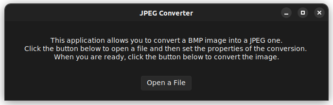
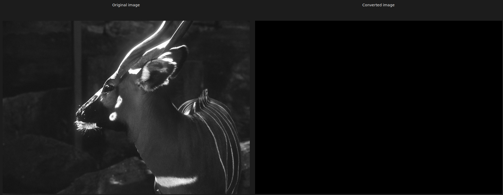
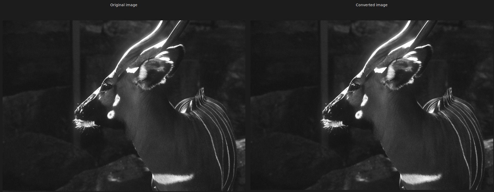
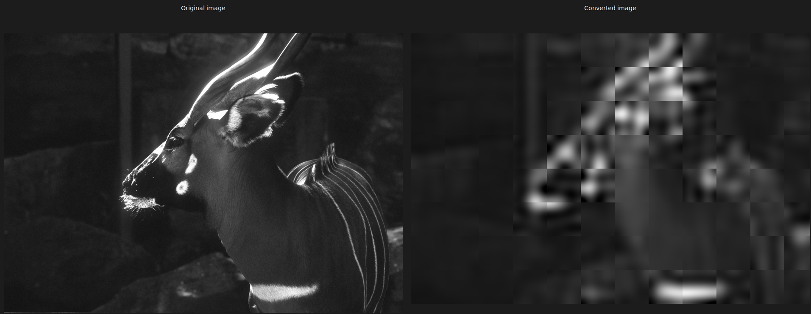

# Introduzione

Il repository è composto da due parti:

1.  Implementazione della propria DCT2 (My DCT)

2.  Realizzazione di un software per convertire le immagini in formato
    BMP ad un formato compresso simil-JPEG (BMP converter)

# [My DCT](https://github.com/epi-xel/dct-compression/blob/main/my-dct/my_dct_notebook.ipynb)

Per l'implementazione e l'analisi dei tempi della propria DCT2, si è
usufruito degli strumenti messi a disposizione di Jupyter, scrivendo il
codice in Python.

Si sono pertanto utilizzate le liberie `numpy` per l'implementazione
propria della DCT e `scipy.fftpack` per l'utilizzo della DCT fast già
implementata. La libreria in particolare forniva solo la DCT applicabile
a vettori, si è quindi implementata la DCT2 in un metodo a parte. Per
ottenere lo scaling opportuno, è stato necessario passare nel metodo il
parametro `norm=’ortho’`.

Relativamente ai grafici si è fatto uso delle librerie `matplotlib`,
`pandas` e `seaborn`; infine dato che l'esecuzione degli algoritmi su
matrici molto grosse era computazionalmente molto pesante, si sono
utilizzate alcune librerie per implementare una parallelizzazione
dell'esecuzione degli algoritmi sulle matrici di test.

Il notebook è strutturato in modo tale da mantenere le varie
funzionalità divise tra loro, con alcuni metodi per la generazione di
matrici.

Si è quindi scritto il codice per eseguire la propria DCT, applicando la
formula della DCT di tipo II per ricavare i coefficienti della nuova
base:

$$c_k = \alpha_{k}^{N} \sum\limits_{i=0}^{N-1} f_i \cos \biggl(\pi k \dfrac{2i+1}{2N} \biggl), \quad k = 0, ..., N-1$$
dove $\alpha_{k}^{N} = \frac{1}{\Vert w_k \Vert}$ è il fattore di
normalizzazione:

$$\alpha_{k}^{N}=
\begin{cases}
\frac{1}{\sqrt{N}} & \text{se } k=0 \\
\sqrt{\frac{2}{N}} & \text{se } k\neq0
\end{cases}$$

Una volta implementati i metodi per il calcolo della DCT su matrici, si
sono prodotte una serie di matrici di test, generate con numeri casuali
da 0 a 255.

Si sono poi eseguiti entrambi gli algoritmi sulle matrici di test
parallelizzandoli, e si sono infine prodotti i grafici relativi ai
tempi.

#### Studio del limite superiore

Come prima cosa si è voluto osservare la crescita del tempo
computazionale. Banalmente nell'implementazione dell'algoritmo
osserviamo nella DCT un doppio ciclo da 1 a N, che porta quindi a
$O(n^2)$, tempo che con la DCT2 che viene applicata prima a righe poi a
colonne si alza fino a $O(n^3)$.

Si sono quindi prodotte delle matrici dalla dimensione di $2 \times 2$
fino a $330 \times 330$, incrementando ogni volta la dimensione del lato
di 2 unità (si noti che questi numeri sono stati scelti empiricamente
osservando la capacità e i tempi computazionali della macchina su cui si
stavano eseguendo gli algoritmi).

Possiamo osservare i risultati della computazione nella figura
[1](#fig:2to330), in scala
semilogaritmica.

Analizzando i risultati *My DCT* ha un andamento regolare di tipo
polinomiale, come ci saremmo aspettati date le analisi preliminari.

La DCT fast presenta invece un profilo irregolare ma pur sempre
polinomiale, anche se di ordine inferiore rispetto a *My DCT*. Le
diverse irregolarità sono dovute probabilmente alle ottimizzazioni
implementate dalla libreria utilizzata.

#### Studio del caso ottimizzato per la DCT fast

Si rende necessario riportare alcune nozioni riguardanti l'algoritmo
utilizzato per la DCT fast. Quest'ultimo è infatti ottimizzato secondo
un algoritmo divide-et-impera, ergo il caso in cui la grandezza del lato
delle matrici è una potenza di 2 è il suo caso migliore. Le
ottimizzazioni interne dovute a questo giustificano in parte l'andamento
irregolare della curva, che vede una decrescita del tempo computazionale
in corrispondenza delle dimensioni che rispondono bene alle divisioni
per due.

# [BMP converter](https://github.com/epi-xel/dct-compression/tree/main/bmp-to-jpeg)

La seconda parte del progetto vede l'implementazione di un'interfaccia
grafica che, selezionata un'immagine BMP in toni di grigio, vi applica
un algoritmo di compressione simil-jpeg ma senza utilizzare una matrice
di quantizzazione.

## Librerie utilizzate

Per l'implementazione del software per comprimere immagini BMP si è
utilizzato sempre il linguaggio Python ma il codice è stato strutturato
secondo un'architettura ben definita a moduli.

In particolar modo, l'interfaccia grafica si è ottenuta grazie a due
librerie per GUI di Python: Tkinter e PyQt5. Per permettere a questi due
librerie di lavorare insieme armoniosamento si sono utilizzate alcune
librerie per la gestione di thread e processi. Relativamente al tema che
è stato applicato all'interfaccia grafica di Tkinter, si è sfruttata una
libreria open-source disponibile su GitHub al seguente repository:
[*rdbende/Sun-Valley-ttk-theme*](https://github.com/rdbende/Sun-Valley-ttk-theme).
Inoltre l'applicazone è resa interamente responsive.

Il back-end è stato invece implementato con l'asilio delle librerie
Numpy e FFTPACK di Scipy per l'elaborazione numerica e Pillow per la
manipolazione di immagini.

## [Back-end](https://github.com/epi-xel/dct-compression/blob/main/bmp-to-jpeg/utils/converter.py)

Nel modulo per la conversione dell'immagine sono presenti due metodi ausiliari che caricano
dapprima l'immagine convertendola in una mappa di pixel e poi ancora in
una matrice facilmente trattabile.

Il metodo principale prende in ingresso quindi la mappa di pixel e i
parametri $F$ e $d$.

Al suo interno viene prima di tutto chiamato un metodo che divide
l'immagine in blocchi, che consistono in piccole sottomatrici.

Per ogni blocco vengono poi applicate in sequenza DCT2, eliminazione
delle frequenze, arrotondamento e normalizzazione dei valori e infine la
DCT2 inversa (ciacuna di queste operazioni è definita in un metodo
apposito).

Viene infine chiamato un metodo che assembla nuovamente i blocchi in
ordine e riconverte la matrice in immagine.

Si noti che si è deciso di scartare tutti i pixel sovrabbondanti nella
divisione in blocchi.

## [Front-end](https://github.com/epi-xel/dct-compression/tree/main/bmp-to-jpeg/gui)

L'applicazione una volta eseguita presenta una prima finestra con alcune
istruzioni sul funzionamento e un pulsante per scegliere il file, come
si vede a figura [2](#fig:main).

Cliccando sul pulsante si apre una finestra con esplora risorse da cui
si può selezionare il file BMP che si desidera convertire (figura
[3](#fig:fc)).

Selezionando il file si ritorna alla finestra principale in cui è ora
possibile visualizzare il file scelto (ed eventualmente fare zoom su di
esso). Sotto l'immagine è quindi presente un panel con due *scalebar*
che permettono di impostare la dimensione dei macro-blocchi ($F$) e la
soglia di taglio delle frequenze ($d$). Si è scelto si lasciare come
valore massimo di F la lunghezza del lato più corto dell'immagine,
mentre nell'interfaccia a seconda del valore F selezionato la *scalebar*
relativa a d si ridimensiona dinamicamente come valore massimo, settato
a $2F-2$, come si può osservare nella figura
[4](#fig:tune).

Una volta settati i parametri desiderati cliccando sul pulsante in basso
*Convert* dopo qualche secondo si aprirà una finestra contenente le due
immagini una vicino all'altra, su cui è possibile effettuare uno zoom e
spostamento congiunto (si veda figura
[5](#fig:comp)).

Se si vuole convertire un'altra immagine o convertire la stessa ad
un'altra risoluzione, l'applicazione è strutturata in modo tale da poter
lasciare aperta la finestra per il confronto.

## Considerazioni

Osserviamo come cambia l'immagine compressa rispetto alla grandezza dei
blocchi e della soglia di taglio delle frequenze.

Se si imposta come grandezza del blocco 8, come accade nella
compressione JPEG standard, analizziamo come cambia incrementando man
mano la soglia di taglio delle frequenze.

Impostando $d$ a 0, otteniamo un'immagine completamente nera, poiché non
viene mantenuta nessuna informazione dell'immagine originale (cfr.
figura [6](#fig:d80))

Con $d=1$ si ha che i macroblocchi hanno come colore uniforme la media
dei pixel in quel blocco (cfr. figura [7](#fig:d81))

Ponendo $d=3$, otteniamo invece l'immagine in figura
[8](#fig:d83). L'immagine a
primo impatto sembra uguale, ma le frequenze tagliate sono molte e
zoomando si possono osservare i piccoli quadratini.

Mantenendo invece tutte le frequenze otteniamo invece l'immagine in
figura [9](#fig:d814), che
risulta uguale all'originale.

Si prova quindi a impostare una consistente grandezza dei blocchi, dieci
volte maggiore di quella precedente, e una soglia di taglio molto bassa.
Il risultato è quello in figura [10](#fig:d805): i blocchi sono evidenti e l'immagine è molto
sfocata.

Infine si pone come macroblocco la dimensione del lato minore
dell'immagine e $d=1$. Il risultato ottenuto è un unico blocco che ha
come colore uniforme la media di tutti i pixel nell'immagine, come si
vede in figura [11](#fig:dall1).

